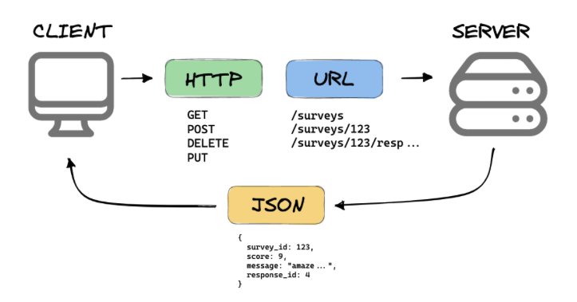

<!-- _class: lead -->

# REST APIs using Spring Boot  
### 3rd semester @ Erhvervsakademi København

<style>
section.lead h1 {
  text-align: center;
  font-size: 2.5em;
}
section.lead h3 {
  text-align: center;
  opacity: 0.6;
}
</style>

---

# What is an API?

- **API** = **A**pplication **P**rogramming **I**nterface
- A set of rules that allows programs to talk to each other
- It is an **abstraction** that allows the user to interact with a system without needing to understand its internal workings
- Can be used to access data or functionality of a service
- Can be local (within the same application) or remote (over the internet)

---

# What is REST?

- **REST** = Representational State Transfer
- Architectural standard for designing **networked applications**
- Based on **HTTP**, using standard methods:
  - `GET`, `POST`, `PUT`, `DELETE`, etc.
- Works with **resources**, typically represented as **JSON**
- **Stateless**: Each request from client to server **must contain all the information** needed to understand and process the request, i.e., **no session state** is stored on the server.
- **Uniform Interface**: A uniform way to interact with **resources**, simplifying the architecture and **decoupling client and server**.

---

# RESTful APIs

- An API that follows REST principles is called a **RESTful API**
- Uses standard **HTTP methods** to interact with resources
- Returns data usually as **JSON**
- Allows different systems to exchange data in a **standardized way**
- Can be **consumed by any client** (browser, mobile app, etc.)
- **Examples:** [GitHub API](https://api.github.com/users?since=76908022), [REMA1000 API](https://api.digital.rema1000.dk/api/v3/products), [ipinfo API](https://ipinfo.io/json) etc.

---

# RESTful APIs cont.
<!-- _class: center, middle -->
<!-- center the image -->


<style>
img {
  display: block;
  margin: 0 auto;
}
</style>

---

# Key Principles

- **Stateless**  
  Each request contains all info needed (no client session on server)

- **Client-Server**  
  Separation of concerns between frontend and backend

- **Uniform Interface**  
  Standard **HTTP** methods: `GET`, `POST`, `PUT`, `DELETE`

- **Resource-Based**  
  Resources are identified by URIs (e.g., `/users`, `/todos`)

---

# REST is Resource-Based

- A **resource** is an object or entity (e.g., user, todo, book)
- Resources are represented as **nouns**, not actions (verbs)

- **Good:**  
  `/users`, `/todos/5`, `/products/13`

- **Avoid:**  
  `/getUser`, `/createTodo`, `/updateProduct`

---

# Naming Conventions

- Use **plural nouns** for resource names  
  → `/todos`, `/users`, `/books`

- Use **lowercase** and **hyphens for readability**  
  → `/order-items`, not `/orderItems`

- Use **sub-resources** for hierarchy  
  → `/users/42/orders`, `/books/5/reviews`

- No verbs in path — actions are determined by **HTTP method**

---

# Example: A Todo API

| Endpoint          | Method | Description             |
|-------------------|--------|-------------------------|
| `/todos`          | GET    | Get all todos           |
| `/todos/{id}`     | GET    | Get a specific todo     |
| `/todos`          | POST   | Create a new todo       |
| `/todos/{id}`     | PUT    | Update an existing todo |
| `/todos/{id}`     | DELETE | Delete a todo           |

---

# JSON Example

A typical response from a REST API is in **JSON format** (JavaScript Object Notation)

`GET /todos/1` might return:

```json
{
  "id": 1,
  "title": "Learn REST APIs",
  "completed": false
}
```

---
## REST with Spring Boot
- Spring Boot makes it easy to build REST APIs
- Provides annotations:
  - `@RestController`
  - `@GetMapping`, `@PostMapping`, etc.
- Automatic JSON conversion (between Java objects and JSON) with Jackson (included in Spring Boot dependencies)

---

## Creating a Simple REST API
**`HelloController.java`**
```java
@RestController // Makes it return data not views
@RequestMapping("/api") // Base URL for this controller
public class HelloController {

    @GetMapping("/hello")
    public String sayHello() {
        return "Hello, World!";
    }
}
```

---

## Returning objects as JSON

```java
@RestController
@RequestMapping("/api")
public class TodoController {
    @GetMapping("/todos")
    public List<Todo> getAllTodos() {
        return List.of(
            new Todo("Learn REST APIs", false),
            new Todo("Build a REST API", false)
        );
    }
}

public class Todo {
    private String title;
    private boolean completed;
    // Constructors, getters, setters
}
```

---

<!-- _class: lead -->
# LIVE DEMO

---

# HTTP Status Codes
- **200 OK**: Request succeeded (e.g., `GET`, `POST`)
- **201 Created**: Resource created (e.g., `POST`)
- **204 No Content**: Request succeeded, no content to return (e.g., `DELETE`)
- **400 Bad Request**: Invalid request (e.g., missing parameters)
- **404 Not Found**: Resource not found (e.g., `GET` on non-existing resource)
- **500 Internal Server Error**: Server error (e.g., unexpected exception)

---

# Setting Response status codes in Spring Boot
You can set the response status code in your controller methods using **`ResponseEntity`**:
```java
@GetMapping("/{id}")
public ResponseEntity<User> getUser(@PathVariable Long id) {
    User user = userService.findById(id);
    if (user != null) {
        return ResponseEntity.ok(user); // 200 OK
    } else {
        return ResponseEntity.notFound().build(); // 404 Not Found
    }
}
```
