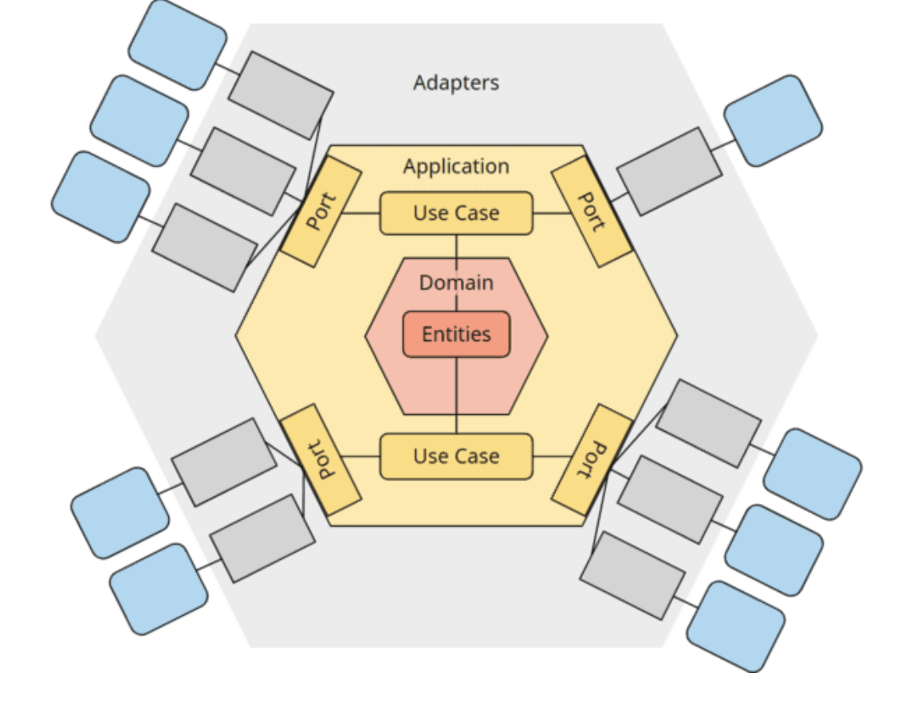

<!-- _class: lead -->

# Exceptions, ControllerAdvice, and External Services
### 3rd semester @ Erhvervsakademi København

---

# Plan

- Java Exceptions
- Spring Boot Exception Handling
- RestTemplate (external HTTP services)
- Design pattern: Adapters

---

# Java exceptions

**Checked exceptions**
- Must be declared in the method signature or handled within the method
- Extends Exception

**Unchecked exceptions**
- Do not need to be declared or handled
- Extends RuntimeException

---

<!-- _class: lead -->

# Live code
### try-catch, finally, unchecked exceptions, checked exceptions and cause

---

# Spring Boot Exception Handling

**`@ControllerAdvice`** & **`@RestControllerAdvice`**
- Global exception handling for all controllers
- Can define multiple `@ExceptionHandler` methods

**`@ExceptionHandler`**
- Handle specific exceptions
- Can return custom responses

**RFC 7807**
- Problem Details for HTTP APIs
- Standard format for error responses

---

<!-- _class: lead -->

# Live code
### @ControllerAdvice & @RestControllerAdvice

---

# `RestTemplate`

- Synchronous client to consume RESTful web services
- Simplifies HTTP requests and error handling
- Can be customized with interceptors and error handlers

**Note:**
- `RestTemplate` is deprecated in favor of `WebClient` (part of Spring WebFlux) for non-blocking, reactive applications.
- We use it for the simplicity, but later in the course we will explore `WebClient` for a more modern approach.

---

<!-- _class: lead -->

# Live code
### @ControllerAdvice & @RestControllerAdvice

---

# Adapter pattern
- Adapter is a design pattern that allows objects with incompatible interfaces to work together.
- They allow for communication between different systems or layers.
- They translate requests and responses between formats.

---

# Ports and Adapters

- Architectural pattern to separate concerns
- Another word for this pattern is **"Hexagonal Architecture"**
- Adapters convert data between different formats
- Ports define interfaces for communication

---

# 

<!-- _class: smallImg -->

---

# Ports and Adapters cont.

- In the center we have the application core domain and business logic
- The core is surrounded by ports (interfaces)
- Adapters implement the ports to connect to external systems
- Adapters enable integration between incompatible interfaces.

**Why?**
- To achieve loose coupling between systems
- To isolate the application core from external concerns
- To facilitate testing and maintenance

---

# Ports and Adapters with Spring Boot

- The way we have used Spring Data JPA so far, mixes concerns and tightly couples the application core with the persistence layer ( by using entity in our model class`@Entity`).
- By applying the Ports and Adapters pattern, we can create a clear separation between the core business logic and the data access implementation.

---

<!-- _class: lead -->

# Live code
### Simple Ports and Adapters Implementation: Product domain
