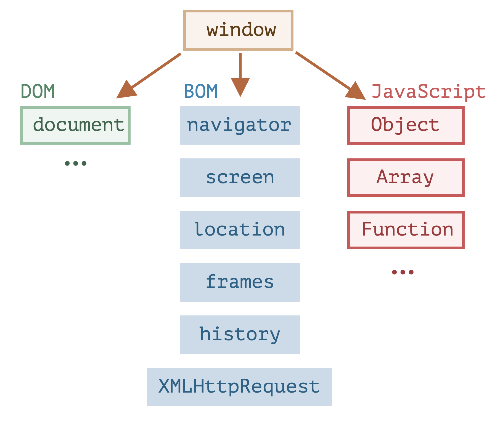
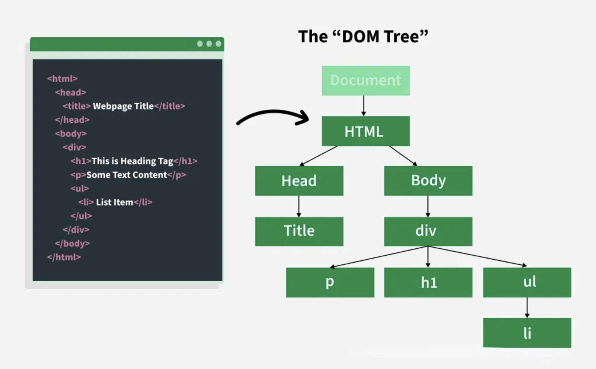

# JavaScript: DOM Manipulation

---

# JavaScript specification

- In ECMAScript (the standard for JavaScript), the **global object** is defined as the top-level object that provides built-in functions and properties.
- Every JavaScript environment (like browsers or Node.js) has its own global object called `globalThis`.
- Each environment has its own set of built-in objects and functions that are part of the global object.

---

# The Global Object in browsers

- The global object in browsers, it's called `window` (`window`==`globalThis`).
- All global variables and functions become properties of the global object.
- Browser environment provides many built-in objects and functions as part of the `window` object.
    - Like `alert`, `setTimeout`, `console`, and more.

**Example:**
```js
window.alert('Hello!'); // Same as alert('Hello!')
window.console.log("Hello world");
```

**Note:** We omit the `window.` prefix when calling global functions or accessing global variables.

---


<!-- _class: img-700 -->




<style>
    section.img-700 {
        display: flex;
        align-items: center;
    }

section.img-700 img{
  width: 700px;
}
</style>

---

# What is the DOM?
- The DOM (Document Object Model) is a tree-like structure representing all the elements on a web page.
- JavaScript can read, change, add, or remove elements in the DOM, making your page interactive.
- The DOM is part of the global `window` object, accessible via `window.document` or simply `document`.


---

<!-- _class: flex -->



<style>
section.flex  {
    display: flex;
}
</style>


---

# DOM

- The DOM is created by the browser when it loads a web page.
- Every HTML element becomes a DOM node that JavaScript can interact with.
- You can use JavaScript to:
  - Select elements
  - Change their content or style
  - Respond to user actions (like clicks)
  - Add or remove elements dynamically

---

# Prototypical Inheritance

- JavaScript uses prototypical inheritance, meaning objects can inherit properties and methods from other objects.
- Every object has a prototype (another object) from which it can inherit properties.
- The prototype chain allows for shared behavior and properties among similar objects.

```javascript
const obj = {};
console.log(obj.toString()); // Inherited from Object.prototype
```

---

# Prototypical Inheritance vs Java Inheritance

- In Java, classes define the structure and behavior of objects, and inheritance is based on class hierarchies.
- In JavaScript, objects can inherit directly from other objects without the need for classes.
- JavaScript's prototypical inheritance allows for more dynamic and *flexible* object relationships.

```javascript
const parent = { greet: () => 'Hello' };
const child = Object.create(parent);
console.log(child.greet()); // Inherited from parent
```

---

# Why bother with Prototypical Inheritance?

- Some DOM objects inherit properties and methods from other DOM objects.
- This allows for shared behavior and properties among similar DOM elements.
- An `HtmlButtonElement` inherits from `HTMLElement`, which inherits from `Element`, which inherits from `Node`, which inherits from `EventTarget`.
- Inside `EventTarget`, we find methods like `addEventListener`, which we will later see in action.

**Each level in the prototype chain adds more specific functionality.**


---

# Overview
1. Traversing the DOM
2. Reading DOM Elements
3. Handling Events
4. Changing DOM element content
5. Toggling CSS Classes
6. Adding & Removing List Items
7. Data Attributes
8. Toggling Sections
9. Handling Forms

---

# Traversing the DOM

- The DOM is a tree structure, and you can navigate through it using various properties and methods.
- Common ways to traverse the DOM elements:
    - `parentElement`: Access the parent element.
    - `children`: Access the child elements.
    - `nextElementSibling`: Access the next sibling element.
    - `previousElementSibling`: Access the previous sibling element.
    - `firstElementChild`: Access the first child element.
    - `lastElementChild`: Access the last child element.

These properties returns **element nodes**, ignoring text nodes (like spaces or line breaks).

---

# Traversing the DOM (continued)

**Example:**
```js
const child = document.children[0];
const firstChild = child.firstElementChild;
const lastChild = child.lastElementChild;
const nextSibling = firstChild.nextElementSibling;
const previousSibling = lastChild.previousElementSibling;
```
**Each is an object representing a DOM element.**

---

# Exercise 1
Traverse the DOM and find the "Target element" paragraph. Log the element to the console.

---

## Retrieving DOM Elements

Instead of traversing the DOM manually, you often want to select specific elements directly.

**Common ways to select elements:**
- `getElementById('id')`: Selects a single element by its unique ID.
- `getElementsByClassName('class')`: Selects all elements with a given class (returns a collection).
- `getElementsByTagName('tag')`: Selects all elements with a given tag name.
- **`querySelector('selector')`**: Selects the first element that matches a CSS selector.
- **`querySelectorAll('selector')`**: Selects all elements that match a CSS selector (returns a NodeList).


---

## Retrieving DOM Elements (continued)

**Using `querySelector` and `querySelectorAll` is often the most flexible way to select elements.**
But it requires understanding of CSS selectors:
- `#myId` for ID
- `.myClass` for class
- `div` for tag name

**Example:**
```js
const heading = document.querySelector('#someId'); // Select by ID
const items = document.querySelectorAll('.item'); // Select all by class
const allButtons = document.querySelectorAll('button'); // Select all buttons
```

**Tip:** Check if your selection worked (it may return `null` if not found).

---

## Useful properties of selected elements
- `.textContent`: Get or set the text inside an element.
- `.innerHTML`: Get or set the HTML content inside an element.
- `.classList`: Access the list of classes on an element (useful for adding/removing classes).
- `.value`: Get or set the value of form elements (like input, textarea).
- `.id`: Get or set the ID of an element.
- `.style`: Access or change the inline styles of an element.


---

## Getting and setting content of DOM elements

```javascript
const p = document.querySelector('p');
console.log(p.textContent); // Get text
p.textContent = 'New text content'; // Set text
```
---

## Template used in exercises

```js
window.addEventListener('load', initApp);

function initApp() {
	// Your code here
}
```
**`initApp` runs when the page is fully loaded, and serves as an entrypoint.**

---

## Handling Events

Web pages become interactive by responding to user actions, called **events** (like clicks, submitting forms, or moving the mouse).

**How to handle events:**
- Use `addEventListener` to tell the browser what code to run when an event happens.

**Example:**
```js
const button = document.querySelector('#myButton');
button.addEventListener('click', function() {
  alert('Button was clicked!');
});
```

**Common events:**
- `click`, `submit`, `mouseover`

---

### Exercise 2

Add a click event to a button. When the button is clicked, take all messages and concatenate them into a single string, then display that string in the output div.

---

## Toggling CSS Classes

CSS classes control how elements look. You can add, remove, or toggle classes with JavaScript to change styles dynamically.

**The `classList` property:**
- `element.classList.add('className')`: Add a class
- `element.classList.remove('className')`: Remove a class
- `element.classList.toggle('className')`: Add if missing, remove if present

**Example:**
```js
const box = document.querySelector('#box');
box.classList.toggle('highlight');
```

**Why use this?**
- To highlight, hide, or animate elements in response to user actions.

---

### Exercise 3

Toggle a CSS class on an element when a button is clicked. Try changing the color or size of the element.

---


## Adding & Removing Elements

You can create new elements and add them to the page, or remove existing ones.

**How to add an element:**
1. Use `document.createElement('tag')` to make a new element.
2. Set its content or attributes.
3. Use `parent.appendChild(newElement)` to add it to the page.

**How to remove an element:**
- Call `.remove()` on the element you want to delete.


---

**Example:**
```js
const ul = document.querySelector('#myList');
const li = document.createElement('li');
li.textContent = 'New item';
ul.appendChild(li); // Add
li.remove(); // Remove
```

---

### Exercise 4

Create a full DOM structure using only JavaScript.

---

# Exercise 5
Add and remove list items using buttons.

---

## Data Attributes

Sometimes you need to store extra information on an element that isn't part of the standard HTML attributes. **Data attributes** let you do this.

**How to use:**
- Add a custom attribute like `data-id="1"` in your HTML.
- Access it in JavaScript with `element.dataset.id` or `element.getAttribute('data-id')`.

**Why use data attributes?**
- Store state or extra info for scripts without affecting the appearance or meaning of the HTML.

---

## Data Attributes (continued)

**Example (removing a specific item):**
```html
<ul>
    <li data-id="1">Some text</li>
</ul>
```
```js
const li = document.querySelector('li[data-id="1"]');
console.log(li.dataset.id); // "1
li.remove();
```

---

### Exercise 6

Toggle a data attribute on a button and display its value on the page.

---

## Handling Forms

Forms let users enter data. You can use JavaScript to process this data and update the page.

**How to handle a form:**
1. Listen for the `submit` event on the form.
2. Prevent the default page reload with `event.preventDefault()` (what happens by default?)
3. Read the values from the form fields.
4. Do something with the data (like adding it to a list or sending it to a server).

---

## Handling Forms (continued)

**Example:**
```js
const form = document.querySelector('#myForm');
form.addEventListener('submit', handleSubmit);

function handleSubmit(event) {
  event.preventDefault(); // Prevent page reload
  const target = event.target;
  const form = new FormData(target);
  const name = form.get('name'); // Assuming there's an input with name="name"
  console.log(name); // Do something with the name
}
```

---

### Exercise 7

Handle a form submission and display the entered data in the DOM.
