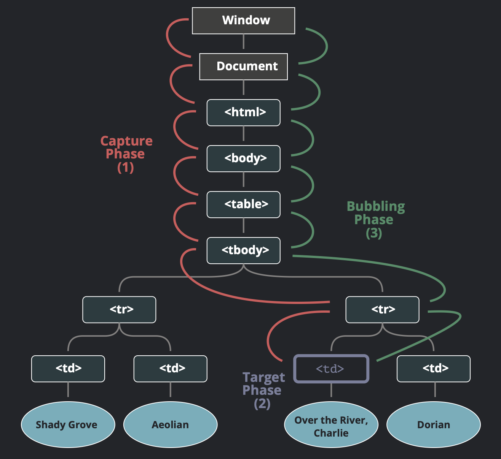

<!-- _class: lead -->

# JavaScript: DOM 2 (events)

<style>
section.lead h1 {
  text-align: center;
  font-size: 2.5em;
}
</style>

---

# Program:
- Recap of DOM manipulation
- Event object
- Removing event listeners
- Form events
- Event delegation
- Event (propagation) bubbling and capturing
- Events
- Forms with all input types
- Simple game


---
# Recap

---

<!-- _class: img-900 -->


<style>
    section.img-900 {
        display: flex;
        align-items: center;
    }

section.img-900 img{
  width: 900px;
}
</style>

---

## Getting DOM elements

**We can get DOM elements using several methods:**
- `const el = document.getElementById("my-id");`
- `const els = document.getElementsByClassName("my-class");`
- `const els = document.getElementsByTagName("div");`
- **`const el = document.querySelector(".my-class");`**
- **`const els = document.querySelectorAll(".my-class");`**

---

## Manipulating DOM elements
**We can manipulate DOM elements in several ways:**
- Change content: `el.textContent = "New text";`
- Change HTML: `el.innerHTML = "<span>New HTML</span>";`
- Change styles: `el.style.color = "red";`
- Change attributes: `el.setAttribute("data-info", "value");`
- Toggle classes: `el.classList.toggle("new-class");`
- Create new elements: `const newEl = document.createElement("div");`
- Append elements: `parentEl.appendChild(newEl);`
- Remove elements: `el.remove();`

---

## Event listeners
**We add an event listener to a DOM element:**
`el.addEventListener("click", handleClick);`

---

# Example

```js
const button = document.querySelector("#myBtn");
const container = document.querySelector("#container");

button.addEventListener("click", handleClick);

function handleClick(event) {
  container.classList.toggle("active");
  container.style.backgroundColor = "blue";
  console.log("Button clicked!");
}
```
---

# Events

---

# Question

## *How and why do we get the `event` object in an event handler?*

```js

el.addEventListener("click", function(event) {
  console.log(event);
});
```


---

# Question

## *How can we remove an event listener, after it has been fired once?*

---

# Question

## *How do we submit forms? And what is the default behaviour?*

```html
<form>
  <input type="text" />
  <button type="submit">Submit</button>
</form>
```

---

# Forms

- Use `event.preventDefault()` to prevent the default behaviour of a form submission (page reload).

- Use `const form = new FormData(event.target)` to get form data.

- Access the form data with `form.get('inputName')`.
  - `inputName` must match the `name` attribute of the input field.

---

# Question

## How do we handle events on multiple child elements efficiently?

```js
<ul id="parent">
  <li>Item 1</li>
  <li>Item 2</li>
  <li>Item 3</li>
</ul>
```

---

# Event Delegation
- Instead of adding event listeners to each child element, we can **add a single event listener to the parent element**.
- The parent element listens for events that **bubble up from its children**.
- Use `event.target` to determine which child element triggered the event.

**TIP:**
Use `event.target.closest('selector')` to find the nearest ancestor that matches the selector.

---

# Event Bubbling and Capturing
- Events propagate through the DOM in two phases: capturing and bubbling.
- Capturing phase: The event starts from the root and goes down to the target element.
- Bubbling phase: The event bubbles up from the target element back to the root.
- By default, event listeners listen during the bubbling phase.

---

<!-- _class: img-700 -->




<style>
    section.img-700 {
        display: flex;
        align-items: center;
    }

section.img-700 img{
  width: 700px;
}
</style>

---

# Events

There exist many types of events, that we can attach event listeners to:
- Mouse events: `click`, `dblclick`, `mouseover`, `mouseout`, `mousemove`, `mousedown`, `mouseup`
- Keyboard events: `keydown`, `keyup`, `keypress`
- Form events: `submit`, `change`, `input`, `focus`, `blur`
- Window events: `load`, `resize`, `scroll`, `unload`
- Clipboard events: `copy`, `cut`, `paste`

**Let us look at some examples...**

---

# Game

**We want to build a clicker game, where the user has to click a button as many times as possible.**

- We will track the number of clicks.
- We will track the clicks per second.
- We will track the maximum clicks per second.

**Extra:**
- Persist the maximum clicks per second in `localStorage`.

---

# Exercise: Guess My Number
