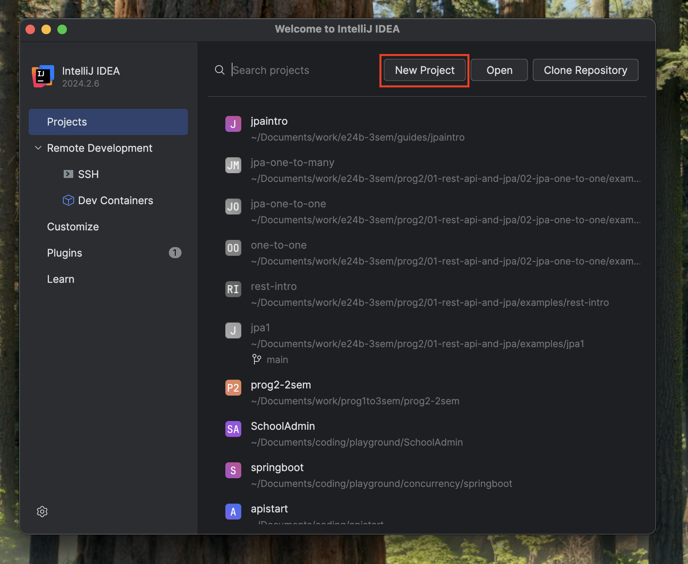

# Creating a Spring Boot Project

There are two ways of creating a Spring Boot application:

- Using IntelliJ IDEA  
- Using [start.spring.io](https://start.spring.io)

---

## Using IntelliJ IDEA

1. Open **IntelliJ IDEA** and go to `File → New → Project`.

2. In the left sidebar, choose **Spring Initializr**.

3. Configure the project:
   - **Project SDK**: We will use Java 21.
   - **Group**: `com.example` (give it an appropriate name)
   - **Artifact**: `demo` (or a custom name)
   - **Name**: A descriptive name (e.g., `rest-api-demo`)
   - **Type**: Maven
   - **Language**: Java
   - Click **Next**.

4. Select dependencies:
   - `Spring Web`
   - `Spring Data JPA` (for database access)
   - `H2 Database` (or any other DB of your choice)
   - `MySQL Driver` (for accessing MySQL dbs)

5. Click **Finish** to generate the project.

6. Once created, open `DemoApplication.java` and run it to verify everything works.

7. You can now start creating controllers, services, and repositories.

---

## Using start.spring.io

1. Go to [start.spring.io](https://start.spring.io).

2. Fill out the form:
   - **Project**: Maven
   - **Language**: Java
   - **Spring Boot Version**: (latest stable)
   - **Group**: `com.example`
   - **Artifact**: `demo`
   - **Name**: `rest-api-demo`

3. Add dependencies:
   - `Spring Web`
   - `Spring Boot DevTools` (optional)
   - `Spring Data JPA`
   - `H2 Database` or `PostgreSQL`, etc.

4. Click **Generate**, and it will download a `.zip` file.

5. Unzip the project and open it in IntelliJ IDEA or your IDE of choice.

6. Run the application from `DemoApplication.java`.

---

## Next Steps

- Create your first REST controller in `src/main/java/com/example/demo/controllers`.
- Explore application configuration in `src/main/resources/application.properties`.
- Test your endpoints using Postman, curl, or your browser.

