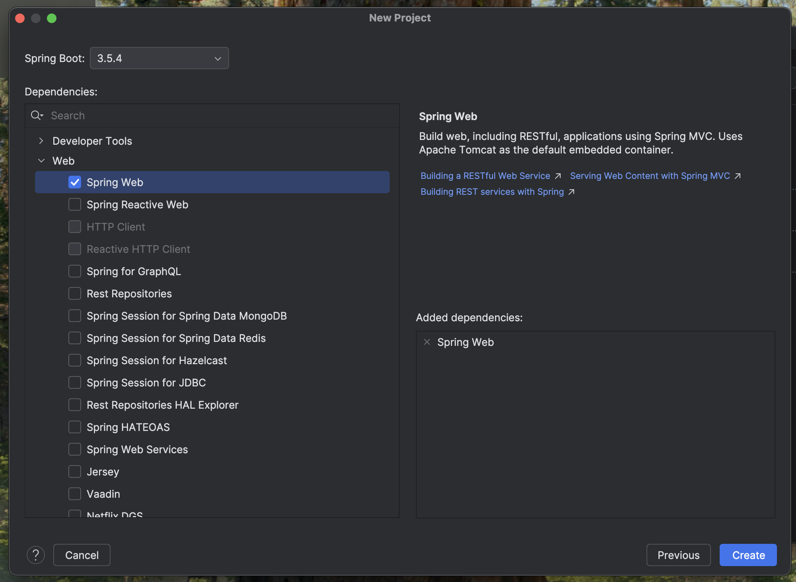
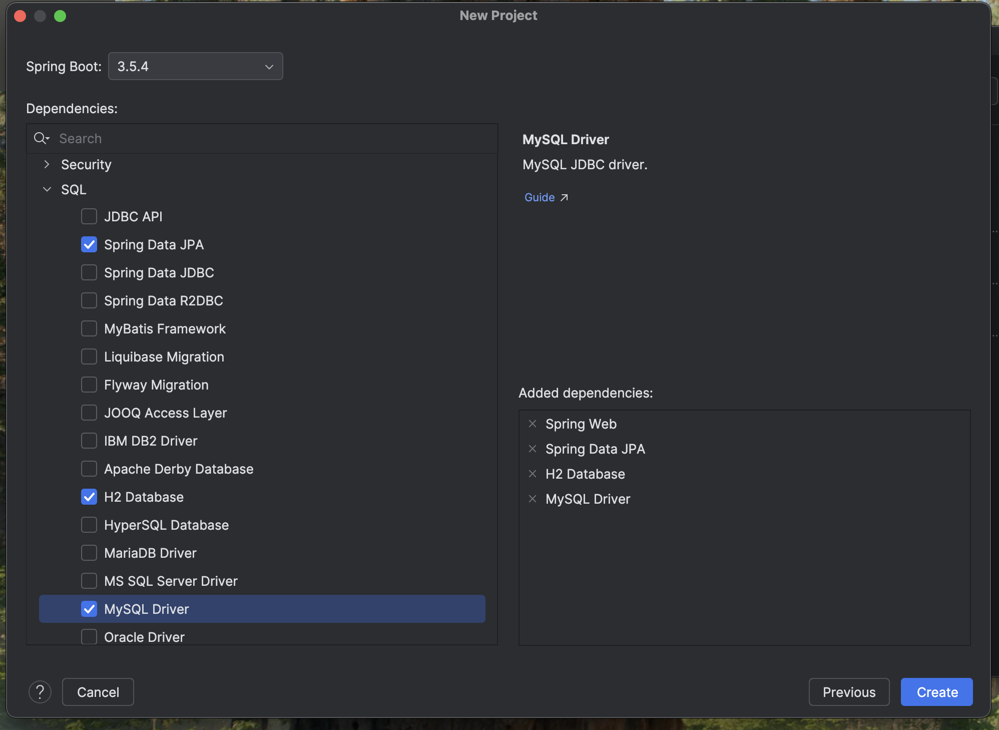

# Creating a Spring Boot Project

There are two ways of creating a Spring Boot application:

- Using IntelliJ IDEA  
- Using [start.spring.io](https://start.spring.io)

We will use IntelliJ IDEA.

---

## Using IntelliJ IDEA

1. Open **IntelliJ IDEA** and go to `File → New → Project`.

2. In the left sidebar, choose **Spring Initializr**.

3. Configure the project:
   - **Project SDK**: We will use Java 21.
   - **Group**: `com.example` (give it an appropriate name)
   - **Artifact**: `demo` (or a custom name)
   - **Name**: A descriptive name (e.g., `rest-api-demo`)
   - **Type**: Maven
   - **Language**: Java
   - Click **Next**.


4. Select dependencies:
   - `Spring Web`
   - `Spring Data JPA` (for database access)
   - `H2 Database` (for testing purposes) 
   - `MySQL Driver` (for MySQL access)





5. Click **Create** to generate the project.

6. Once created, open `DemoApplication.java` and run it to verify everything works.

---


## Configuration for database access
- Navigate to `src/main/resources/application.properties`
``` properties
spring.application.name=demo

# H2 Configuration
#spring.datasource.url=jdbc:h2:mem:testdb
#spring.datasource.driver-class-name=org.h2.Driver
#spring.datasource.username=sa
#spring.datasource.password=

#spring.h2.console.enabled=true 
#spring.h2.console.path=/h2-console

# MySQL configuration - REPLACE WITH OWN DB
spring.datasource.url=jdbc:mysql://localhost:3306/testdb
spring.datasource.username=root
spring.datasource.password=test
spring.jpa.hibernate.ddl-auto=create
spring.datasource.driver-class-name=com.mysql.cj.jdbc.Driver
```

Run the application again to verify database access.

---

## Common issues
- TODO

