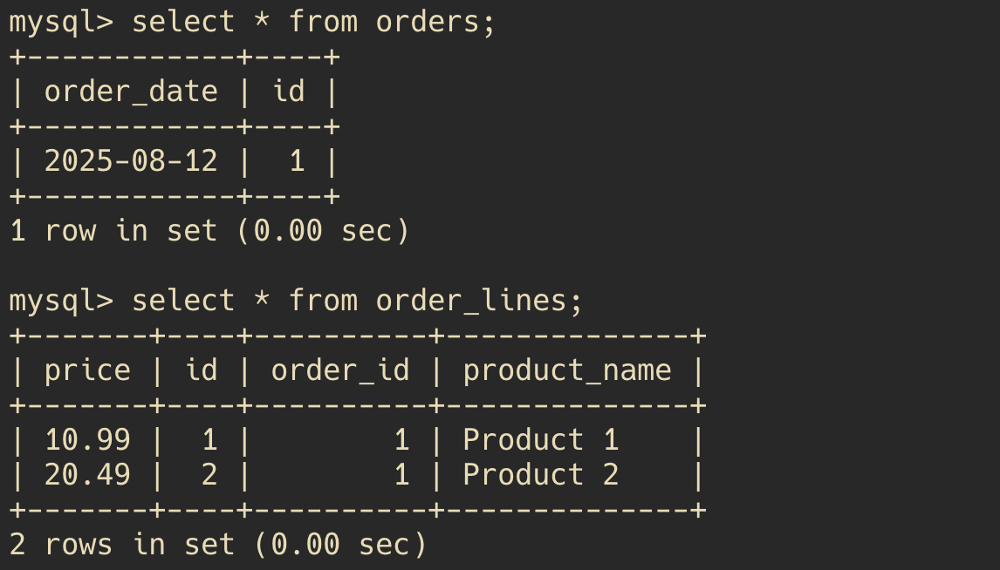

# Spring Data JPA - One-to-Many and Many-to-One Relationships

## Introduction
In this guide, we will explore how to model One-to-Many and Many-to-One relationships in Spring Data JPA. We will cover the necessary annotations, how to set up the entities, and how to manage these relationships.

One-to-Many / Many-to-One relationships are common in database design, where one entity can be associated with multiple instances of another entity. For example, a `OrderLine` can have multiple `Orders`, a `Course` can have multiple `CourseOfferings`, a `Student` can have multiple `Enrollments`, etc.

## Setup
- Create a Spring Boot project with Spring web and Spring Data JPA, H2 database and MySQL dependencies - name the project `one-to-many`
- Use the following configuration in `application.properties` to set up the H2 database:
```properties
# H2 Database Configuration
spring.datasource.url=jdbc:h2:mem:testdb
spring.datasource.driver-class-name=org.h2.Driver
spring.datasource.username=sa
spring.datasource.password=
spring.h2.console.enabled=true
spring.h2.console.path=/h2-console

spring.jpa.hibernate.ddl-auto=create-drop

## Logging
spring.jpa.show-sql=true
logging.level.org.hibernate.SQL=DEBUG
logging.level.sql=DEBUG
```

## Simple example
Let's consider a simple example where we have a `OrderLine` entity and an `Order` entity. An `Order` can have multiple `OrderLines`, but each `OrderLine` belongs to only one `Order`.

In SQL this relationship can be represented as follows:
```sql
CREATE TABLE orders (
    id BIGINT NOT NULL AUTO_INCREMENT PRIMARY KEY,
    order_date DATE
);

CREATE TABLE order_line (
    id BIGINT NOT NULL AUTO_INCREMENT PRIMARY KEY,
    productName VARCHAR(255) NOT NULL,
    price FLOAT(53) NOT NULL,
    order_id BIGINT NOT NULL,
    FOREIGN KEY (order_id) REFERENCES orders(id)
);
```

We will model this relationship using JPA annotations, and begin with a unidirectional Many-to-One relationship (as this is the simplest form). The `OrderLine` entity will have a foreign key reference to the `Order` entity.

Create the following entities in the `org.example.onetomany.models` package:

```java
@Entity
@Table(name = "orders") // This specifies the table name in the database
public class Order {
    @Id
    @GeneratedValue(strategy = GenerationType.IDENTITY)
    private Long id;
    private LocalDate orderDate;
    // Getters and Setters
}
```

```java
@Entity
@Table(name = "order_lines") // This specifies the table name in the database
public class OrderLine {
    @Id
    @GeneratedValue(strategy = GenerationType.IDENTITY)
    private Long id;
    private String productName;
    private double price;
    @ManyToOne
    @JoinColumn(name = "order_id", nullable = false) // This specifies the foreign key column in the order_line table
    private Order order;
    // Getters and Setters
}
```

In the above code:
- The `@ManyToOne` annotation indicates that many `OrderLine` entities can be associated with one `Order`. And that the `OrderLine` is the owning side of the relationship (eg. it contains the foreign key).
- The `@JoinColumn` annotation specifies the foreign key column in the `order_lines` table that references the `orders` table. **This is optional**. The only required annotation is `@ManyToOne`.
- The `nullable = false` attribute ensures that every `OrderLine` must be associated with an `Order`.
- The `@Table` annotation specifies the table name in the database, which is optional if the class name matches the table name. But in SQL databases the keyword `order` is reserved, so we use `orders` instead.


We create the repositories for both entities, in the `org.example.onetomany.repositories` package:
```java
public interface OrderLineRepository extends JpaRepository<OrderLine, Long> {
}
```
```java
public interface OrderRepository extends JpaRepository<Order, Long> {
}
```

### Using the Repositories
You can use these repositories to perform CRUD operations on the entities. For example, to save an `Order` with multiple `OrderLines`, you can do the following to the `org.example.onetomany.config` package:
```java
@Component
public class InitData implements CommandLineRunner {

    private OrderRepository orderRepository;    
    private OrderLineRepository orderLineRepository;

    public InitData(OrderRepository orderRepository, OrderLineRepository orderLineRepository) {
        this.orderRepository = orderRepository;
        this.orderLineRepository = orderLineRepository;
    }

    public void run(String... args) {
        Order order = new Order();
        order.setOrderDate(LocalDate.now());
        orderRepository.save(order);

        OrderLine line1 = new OrderLine();
        line1.setProductName("Product 1");
        line1.setPrice(10.99);
        line1.setOrder(order);
        orderLineRepository.save(line1);

        OrderLine line2 = new OrderLine();
        line2.setProductName("Product 2");
        line2.setPrice(20.49);
        line2.setOrder(order);
        orderLineRepository.save(line2);
    }
}
```
Notice that:
- We first save the `Order` entity before saving the `OrderLine` entities. This is because the `OrderLine` needs to reference an existing `Order`.
- In addition, how does `line1.setOrder(order);` work? The `Order` entity becomes managed by the JPA context when we call `orderRepository.save(order);`. This means that the `Order` entity has an `Id` assigned to it, which is then used by the `OrderLine` entity when we call `line1.setOrder(order);`. (To see this at a print statement before and after the `save` call, you can use `System.out.println(order.getId());` to see the ID assigned by the database.).

In the db you should see the following:


### Creating a REST Controller
To expose the `Order` and `OrderLine` entities via a REST API, we can create a controller in the `org.example.onetomany.controllers` package:

```java
@RestController
@RequestMapping("/api/orders")
public class OrderController {

    private final OrderRepository orderRepository;

    public OrderController(OrderRepository orderRepository) {
        this.orderRepository = orderRepository;
    }

    @GetMapping
    public ResponseEntity<List<Order>> getAllOrders() {
        List<Order> orders = orderRepository.findAll();
        return ResponseEntity.ok(orders);
    }
}
```

By running the application, you can access the endpoint `http://localhost:8080/api/orders` to retrieve all orders:
```json
[
    {
        "id": 1,
        "orderDate": "2025-08-18"
    }
]
```

### Bidirectional Relationships
#### Problem
In the above example, we have a unidirectional relationship where `OrderLine` knows about `Order`, but `Order` does not know about its `OrderLines`. This can be limiting in some cases, especially when you want to access all `OrderLines` from an `Order` entity.

#### Solution
To make the relationship bidirectional, we can add a `List<OrderLine>` field in the `Order` entity and use the `@OneToMany` annotation. This allows us to navigate from `Order` to its associated `OrderLines` in Java code.

```java
@Entity
@Table(name = "orders")
public class Order {
    @Id
    @GeneratedValue(strategy = GenerationType.IDENTITY)
    private Long id;
    private LocalDate orderDate;
    @OneToMany(mappedBy = "order")
    private Set<OrderLine> orderLines = new HashSet<>();
    // Getters and Setters
}
```
In a bidirectional JPA relationship, there are two sides:
- **The owning side** – the side that holds the foreign key (the `OrderLine` entity, eg. the class that has `@ManyToOne`).
- **The inverse side** – the side with mappedBy (`@OneToMany` in `Order`).

##### Testing the Rest API with Bidirectional Relationship
If we now test the application in the browser, cURL or Postman, we get a weird repsonse:
```json
[{"id":1,"orderDate":"2025-08-18","orderLines":[{"id":2,"productName":"Product 2","price":20.49,"order":{"id":1,"orderDate":"2025-08-18","orderLines":[{"id":2,"productName":"Product 2","price":20.49,"order":{"id":1,"orderDate":"2025-08-18","orderLines":[{"id":2,"productName":"Product 2","price":20.49,"order":{"id":1,"orderDate":"2025-08-18","orderLines":[{"id":2,"productName":"Product 2","price":20.49,"order":{"id":1,"orderDate":"2025-08-18","orderLines":[{"id":2,"productName":"Product 2","price":20.49,"order":{"id":1,"orderDate":"2025-08-18","orderLines":[{"id":2,"productName":"Product 2","price":20.49,"order":{"id":1,"orderDate":"2025-08-18","orderLines":[{"id":2,"productName":"Product 2","price":20.49,"order":{"id":1,"orderDate":"2025-08-18","orderLines
```
This is because we have a circular reference between `Order` and `OrderLine`. When the JSON serializer tries to serialize the `Order` entity, it encounters the `orderLines` field, which contains `OrderLine` entities that reference back to the `Order`, creating an infinite loop.
To solve this, we can use DTOs (Data Transfer Objects) to control the data being sent to the client and avoid circular references. We will create a DTO for `Order` and `OrderLine` entities.

Create the following two DTOs in the `org.example.onetomany.dto` package:

```java
// OrderLineDto.java
public record OrderLineDto (
    Long id,
    String productName,
    double price
) {}

// OrderDto.java
public record OrderDto (
    Long id;
    LocalDate orderDate;
    Set<OrderLineDto> orderLines
) {}
```
Now, we can modify the `OrderController` to return the DTOs instead of the entities:

```java
@RestController
@RequestMapping("/api/orders")
public class OrderController {

    private final OrderRepository orderRepository;

    public OrderController(OrderRepository orderRepository) {
        this.orderRepository = orderRepository;
    }

    @GetMapping
    public ResponseEntity<List<OrderDto>> getAllOrders() {
        List<Order> orders = orderRepository.findAll();

        List<OrderDto> orderDtos = new ArrayList<>();
        for (Order order : orders) {
            Set<OrderLineDto> orderLineDtos = new HashSet<>();
            for (OrderLine orderLine : order.getOrderLines()) {
                OrderLineDto orderLineDto = new OrderLineDto(orderLine.getId(), orderLine.getProductName(), orderLine.getPrice());
                orderLineDtos.add(orderLineDto);
            }
            orderDtos.add(new OrderDto(order.getId(), order.getOrderDate(), orderLineDtos));
        }

        return ResponseEntity.ok(orderDtos);
    }
}
```
This approach allows us to control the data being sent to the client and avoid circular references. When running the endpoint we get the following response:
```json
[
    {
        "id": 1,
        "orderDate": "2025-08-18",
        "orderLines": [
            {
                "id": 1,
                "productName": "Product 1",
                "price": 10.99
            },
            {
                "id": 2,
                "productName": "Product 2",
                "price": 20.49
            }
        ]
    }
]
```
In this response does not contain any circular references, and the `Order` entity is represented as a DTO with only the necessary fields.

Notice that this produces the following SQL query:
```sql
SELECT ol1_0.order_id,ol1_0.id,ol1_0.price,ol1_0.product_name FROM order_lines ol1_0 WHERE ol1_0.order_id=?
SELECT ol1_0.order_id,ol1_0.id,ol1_0.price,ol1_0.product_name FROM order_lines ol1_0 WHERE ol1_0.order_id=?
```

This is because the `orderLines` field is **lazily** loaded by default. If you want to eagerly load the `OrderLines` when fetching an `Order`, you can use the `fetch = FetchType.EAGER` attribute in the `@OneToMany` annotation (although not recommended for large datasets as it can lead to performance issues):

```java
@OneToMany(mappedBy = "order", fetch = FetchType.EAGER)
private Set<OrderLine> orderLines = new HashSet<>();
```

### Cascading operations from parent entity
When you have a bidirectional relationship, you can also use cascading operations to automatically persist or delete associations with child entities when the parent entity is saved, updated or deleted. For example, if you want to automatically save `OrderLines` when saving an `Order`, you can use the `cascade` attribute in the `@OneToMany` annotation:

```java
    @OneToMany(mappedBy = "order", cascade = CascadeType.ALL, orphanRemoval = true)
    private Set<OrderLine> orderLines = new HashSet<>();
```
- `cascade = CascadeType.ALL` means that all cascade operations saving, updating, and deleting will be applied to the `OrderLine` entities when the `Order` is saved or deleted. Note that when we remove an `Order`, the foreign key reference in the `OrderLine` will be set to null, but the `OrderLine` entities will not be deleted from the database.
- `orphanRemoval = true` means that if an `OrderLine` is removed from the `Order`'s collection, it will be deleted from the database. This is useful for managing the lifecycle of child entities and ensuring that they are removed when no longer needed.


```java
@OneToMany(mappedBy = "order", cascade = CascadeType.ALL, orphanRemoval = true)
private Set<OrderLine> orderLines = new HashSet<>();
```

This means that we can change the `InitData` class to add `OrderLines` to an `Order` without having to save each `OrderLine` individually. For example:

```java
public void run(String... args) {
    OrderLine line1 = new OrderLine();
    line1.setProductName("Product 1");
    line1.setPrice(10.99);

    OrderLine line2 = new OrderLine();
    line2.setProductName("Product 2");
    line2.setPrice(20.49);

    Order order = new Order();
    order.setOrderDate(LocalDate.now());

    // Sync both sides of the relationship
    line1.setOrder(order);
    line2.setOrder(order);
    order.getOrderLines().add(line1);
    order.getOrderLines().add(line2);

    // This will also save line1 and line2 automatically
    orderRepository.save(order);
}
```
- This will save the `Order` and its associated `OrderLines` in a single operation, thanks to the cascading effect.
- Note that we need to sync both sides of the relationship by setting the `Order` in each `OrderLine` and adding the `OrderLines` to the `Order`. This ensures that both sides of the relationship are aware of each other.

### Creating a utility method for sync'ing relationships
To avoid repeating the code for syncing both sides of the relationship, we can create a utility method in the `Order` class to handle this (since it is the parent entity). This method will add an `OrderLine` to the `Order` and automatically set the `Order` in the `OrderLine`.

This is not strictly necessary, but it helps to keep the code clean and maintainable. Here’s how you can implement this:

```java
@Entity
@Table(name = "orders")
public class Order {
    // Other fields and methods...
    public void addOrderLine(OrderLine orderLine) {
        orderLine.setOrder(this); // Set the Order in the OrderLine
        this.orderLines.add(orderLine); // Add the OrderLine to the Order's collection
    }

    public void removeOrderLine(OrderLine orderLine) {
        orderLine.setOrder(null); // Remove the Order reference from the OrderLine
        this.orderLines.remove(orderLine); // Remove the OrderLine from the Order's collection
    }
}
```
```java
@Entity
@Table(name = "order_lines")
public class OrderLine {
    // Other fields and methods...
    public void setOrder(Order order) {
        this.order = order;
    }
}
```

Note that all operations on the `OrderLines` collection should be done through the `Order` class to ensure that both sides of the relationship are always in sync.
This way, you can add or remove `OrderLines` from an `Order` without having to manually set the `Order` in each `OrderLine`. For example:

#### Adding an `Order` with `OrderLines`
```java
Order order = new Order();
OrderLine line1 = new OrderLine();
order.addOrderLine(line1); // This automatically sets the Order in line1 and adds it
orderRepository.save(order); // This will save the Order and line1
```
#### Adding an `OrderLine` to an existing `Order`
```java
Order order = orderRepository.findById(1L).orElseThrow();
OrderLine line2 = new OrderLine();
order.addOrderLine(line2); // This automatically sets the Order in line2 and adds it
orderRepository.save(order); // This will save the Order and line2
```
#### Removing an `OrderLine` from an `Order`
```java
Order order = orderRepository.findById(1L).orElseThrow();
OrderLine line1 = order.getOrderLines().get(0); // Assuming that it is present
order.removeOrderLine(line1); // This automatically sets the Order in line1 to null and
orderRepository.save(order); // This will save the Order and remove line1 foreign key reference
```

### When to use cascading operations
Cascading operations can be very useful in scenarios where you want to manage the lifecycle of child entities through the parent entity. For example, if you want to automatically persist or delete child entities when the parent entity is saved or deleted, cascading operations can simplify your code and reduce boilerplate.

#### When using cascading operations, ask yourself:
- Do I want to automatically persist or delete child entities when the parent entity is saved or deleted?
- Do I want to manage the lifecycle of child entities through the parent entity?
If the answer is yes, then cascading operations can be very useful. However, be cautious with cascading deletes, as they can lead to unintended data loss if not handled carefully.


## API and service layer
First, we create a **service layer** to handle the business logic for managing `Order` and `OrderLine` entities. This service will use the repositories to perform CRUD operations and manage relationships.

Since we have a bidirectional relationship, we will create DTOs to avoid infinitely recursive serialization when returning `Order` entities with their associated `OrderLines`.

Create the following service class in the `org.example.onetomany.services` package:

```java
@Service
public class OrderService {
    private final OrderRepository orderRepository;

    public OrderService(OrderRepository orderRepository) {
        this.orderRepository = orderRepository;
    }

    // FIND
    public List<OrderDto> getAllOrders() {
        List<Order> orders = orderRepository.findAll();
        List<OrderDto> orderDtos = new ArrayList<>();
        for (Order order : orders) {
            orderDtos.add(toOrderDto(order));
        }
        return orderDtos;
    }

    // FIND by ID
    public OrderDto getOrderById(Long id) {
        Optional<Order> orderOptional = orderRepository.findById(id);
        if (orderOptional.isPresent()) {
            return toOrderDto(orderOptional.get());
        }
        throw new RuntimeException("Order not found with id: " + id);
    }

    // CREATE
    public OrderDto createOrder(OrderDto OrderDto) {
        Order newOrder = toOrderEntity(OrderDto);
        for (var orderLines : newOrder.getOrderLines()) {
            orderLines.setId(null); // Make sure to set ID to null for new OrderLines
        }
        return toOrderDto(orderRepository.save(newOrder));
    }

    // DELETE
    public void deleteOrder(Long id) {
        Optional<Order> orderOptional = orderRepository.findById(id);
        if (orderOptional.isPresent()) {
            orderRepository.delete(orderOptional.get());
        }
        throw new RuntimeException("Order not found with id: " + id);
    }

    // Utility method to convert Order to OrderDto
    public OrderLineDto toOrderLineDto(OrderLine orderLine) {
        return new OrderLineDto(
                orderLine.getId(),
                orderLine.getProductName(),
                orderLine.getPrice()
        );
    }

    public OrderDto toOrderDto(Order order) {
        Set<OrderLine> orderLines = order.getOrderLines();
        Set<OrderLineDto> OrderLineDtos = new HashSet<>();
        for (var orderLine : orderLines) {
            OrderLineDtos.add(toOrderLineDto(orderLine));
        }
        return new OrderDto(
                order.getId(),
                order.getOrderDate(),
                OrderLineDtos
        );
    }

    public OrderLine toOrderLineEntity(OrderLineDto orderLineDto) {
        OrderLine orderLine = new OrderLine();
        orderLine.setId(orderLineDto.id());
        orderLine.setProductName(orderLineDto.productName());
        orderLine.setPrice(orderLineDto.price());
        return orderLine;
    }

    public Order toOrderEntity(OrderDto OrderDto) {
        Order order = new Order();
        order.setId(OrderDto.id());
        order.setOrderDate(OrderDto.orderDate());
        for (OrderLineDto orderLineDto : OrderDto.orderLines()) {
            order.addOrderLine(toOrderLineEntity(orderLineDto));
        }
        return order;
    }
}
````

The Controller class will handle the HTTP requests and responses. It will use the `OrderService` to perform the necessary operations.


```java
@RestController
@RequestMapping("/api/orders")
public class OrderController {

    private final OrderService orderService;

    public OrderController(OrderService orderService) {
        this.orderService = orderService;
    }

    @GetMapping
    public ResponseEntity<List<OrderDto>> getAllOrders() {
        return ResponseEntity.ok(orderService.getAllOrders());
    }

    @GetMapping("/{id}")
    public ResponseEntity<OrderDto> getOrderById(@PathVariable Long id) {
        return ResponseEntity.ok(orderService.getOrderById(id));
    }

    @PostMapping
    public ResponseEntity<OrderDto> createOrder(@RequestBody OrderDto OrderDto) {
        return ResponseEntity.ok(orderService.createOrder(OrderDto));
    }

    @DeleteMapping("/{id}")
    public ResponseEntity<Void> deleteOrder(@PathVariable Long id) {
        orderService.deleteOrder(id);
        return ResponseEntity.noContent().build();
    }
}
```

This controller provides endpoints to:
- Get all orders (`GET /api/orders`)
- Get an order by ID (`GET /api/orders/{id}`)
- Create a new order (`POST /api/orders`)
- Delete an order by ID (`DELETE /api/orders/{id}`)


### Detached entities
An entity is detached when it's no longer managed by the persistence context (i.e., EntityManager). This often happens when:
- The entity was loaded in one transaction/session and used in another.
- You manually set the id on an object assuming it's a "new" entity.
- You're trying to persist() an entity that already exists in the DB (based on its ID).

In our example, if we try to call `orderService.createOrder(OrderDto OrderDto)` and the `OrderLineDtos` already have an ID set, we could get the following exception:
```bash
org.hibernate.PersistentObjectException: detached entity passed to persist: org.example.onetomany.models.OrderLine
```
This means that the `OrderLine` entities already have an ID assigned, and when we try to persist them again, we get an exception.

To avoid this, we should ensure that when creating a new `Order` with `OrderLines`, we do not set the ID on the `OrderLine` entities. This can be done by setting the ID to `null` before saving the `Order`, as done above in the `createOrder` method.

**How to avoid this exception:**
- Only pass managed or new (transient) entities to save(), not detached ones (entities that have an ID set).
- Be cautious with entities pulled from previous sessions/transactions or external sources like DTOs, make sure they are not already persisted in the database.

### Summary
- We have learned how to model One-to-Many and Many-to-One relationships in Spring Data JPA.
- We started with a unidirectional Many-to-One relationship and then made it bidirectional by adding a `Set<OrderLine>` field in the `Order` entity.
- We explored the importance of keeping both sides of the relationship in sync and created utility methods to manage the relationship more easily.
- We have also created a REST API to manage `Order` and `OrderLine` entities using a service layer and DTOs to avoid recursive serialization issues.
- We discussed cascading operations and how to use them to automatically persist or delete child entities when the parent entity is saved or deleted.
- Finally, we learned about detached entities and how to avoid exceptions when trying to persist them.